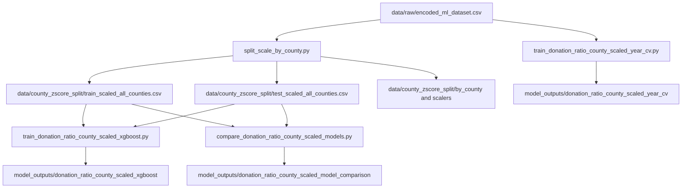

# Donation Ratio Modeling on County-Scaled Data

本專案目前的主體，是以 `donation_ratio` 為 target，使用 `county-level scaling` 後的資料進行建模、模型比較、以及 `rolling year validation`。目前這份 README 只描述**現在最新且實際有產出結果**的流程，不把舊的 clustering / legacy pipeline 當成主軸。

## Current Workflow

目前 active 的流程由以下腳本組成：

- `split_scale_by_county.py`
- `train_donation_ratio_county_scaled_xgboost.py`
- `compare_donation_ratio_county_scaled_models.py`
- `train_donation_ratio_county_scaled_year_cv.py`

資料來源與結果輸出：

- Raw input: `data/raw/encoded_ml_dataset.csv`
- Preprocessed output: `data/county_zscore_split/`
- Modeling output: `model_outputs/donation_ratio_county_scaled_xgboost/`
- Model comparison output: `model_outputs/donation_ratio_county_scaled_model_comparison/`
- Rolling CV output: `model_outputs/donation_ratio_county_scaled_year_cv/`

## Architecture



## Data and Preprocessing

`split_scale_by_county.py` 會先從 raw dataset 讀取 `month`，再建立 `date` 與 `year`，之後做固定年份切分：

- train: `year < 2024`
- test: `year >= 2024`

接著資料會依 `county_label` 分組，每個縣市各自 fit 一個 `StandardScaler`。這個 scaler 只會在該縣市的 train group 上 fit，再拿去 transform 對應的 test group，避免資料洩漏。

目前重要欄位規則如下：

- target: `donation_ratio`
- `donation_ratio` 不做 scaling
- `donation_count` 目前已納入 scaled numeric features
- 類別欄位 `county_label`、`industry_label`、`carrier_type_label` 不做 numeric scaling，而是在建模時做 `one-hot encoding`

主要 preprocessing 產物：

- `data/county_zscore_split/train_scaled_all_counties.csv`
- `data/county_zscore_split/test_scaled_all_counties.csv`
- `data/county_zscore_split/by_county/`
- `data/county_zscore_split/scalers/`

## Current Results

### 1. Single-model XGBoost

來源：

- `model_outputs/donation_ratio_county_scaled_xgboost/metrics.json`

目前結果：

- `RMSE = 0.001405`
- `MAE = 0.000846`
- `sMAPE = 12.813683`
- `epsilon-MAPE = 11.871100`
- `R2 = 0.933988`

對應圖與檔案：

- `model_outputs/donation_ratio_county_scaled_xgboost/performance_result.png`
- `model_outputs/donation_ratio_county_scaled_xgboost/feature_importance.csv`
- `model_outputs/donation_ratio_county_scaled_xgboost/feature_importance.png`
- `model_outputs/donation_ratio_county_scaled_xgboost/validation_predictions.csv`

### 2. Multi-model Comparison

來源：

- `model_outputs/donation_ratio_county_scaled_model_comparison/model_comparison.csv`

目前比較結果如下：

| Model | RMSE | MAE | R2 |
| --- | ---: | ---: | ---: |
| Random Forest | 0.001598 | 0.001175 | 0.914561 |
| XGBoost | 0.002013 | 0.001552 | 0.864374 |
| Linear Regression | 0.002113 | 0.001516 | 0.850611 |
| Ridge | 0.002113 | 0.001516 | 0.850561 |
| Lasso | 0.002838 | 0.002081 | 0.730549 |

目前在這組固定 train/test split 上，`Random Forest` 是最佳模型。

對應圖與檔案：

- `model_outputs/donation_ratio_county_scaled_model_comparison/model_comparison.png`
- `model_outputs/donation_ratio_county_scaled_model_comparison/prediction_scatter.png`
- `model_outputs/donation_ratio_county_scaled_model_comparison/validation_predictions.csv`
- `model_outputs/donation_ratio_county_scaled_model_comparison/metrics.json`

### 3. Rolling Year Validation

來源：

- `model_outputs/donation_ratio_county_scaled_year_cv/metrics_summary.json`
- `model_outputs/donation_ratio_county_scaled_year_cv/metrics_by_fold.csv`

目前的 validation years：

- `2020`
- `2022`
- `2023`
- `2024`

整體摘要：

- `mean RMSE = 0.003577`
- `mean MAE = 0.002156`
- `mean sMAPE = 83.191666`
- `mean epsilon-MAPE = 79880.150258`
- `mean R2 = 0.362993`
- `best R2 year = 2024`
- `worst R2 year = 2022`

逐年觀察：

- `2024` fold 表現最好，`R2 = 0.937196`
- `2023` fold 已有中度可用性，`R2 = 0.526763`
- `2020` 與 `2022` 表現明顯較差，代表早年資料對目前這條建模方式較不穩定

對應圖與檔案：

- `model_outputs/donation_ratio_county_scaled_year_cv/performance_result.png`
- `model_outputs/donation_ratio_county_scaled_year_cv/validation_predictions_by_fold.csv`
- `model_outputs/donation_ratio_county_scaled_year_cv/metrics_by_fold.csv`
- `model_outputs/donation_ratio_county_scaled_year_cv/metrics_summary.json`

## Feature Importance Summary

目前 `XGBoost feature importance` 主要來自：

- `model_outputs/donation_ratio_county_scaled_xgboost/feature_importance.csv`

前幾個最重要特徵為：

1. `county_label_2`
2. `year`
3. `county_label_11`
4. `county_label_18`
5. `county_label_7`
6. `housing_burden`
7. `donation_count`
8. `total_county_invoice_amount`

這代表目前模型的預測能力，很大一部分仍依賴 `county identity` 與時間位置，之後如果要提升泛化能力，應該優先思考如何降低模型對特定縣市 dummy features 的依賴。

## Key Figures

目前建議直接查看以下圖檔：

- `model_outputs/donation_ratio_county_scaled_xgboost/performance_result.png`
- `model_outputs/donation_ratio_county_scaled_xgboost/feature_importance.png`
- `model_outputs/donation_ratio_county_scaled_model_comparison/model_comparison.png`
- `model_outputs/donation_ratio_county_scaled_model_comparison/prediction_scatter.png`
- `model_outputs/donation_ratio_county_scaled_year_cv/performance_result.png`

另外，`data/county_zscore_split/plots/` 下也保留了 county-level distribution 與 month-wise scatter/boxplot 圖，可用來檢查 preprocessing 後的資料分布。

## Reproducibility

從 repo root 可直接重跑目前流程：

```bash
python split_scale_by_county.py
python train_donation_ratio_county_scaled_xgboost.py
python compare_donation_ratio_county_scaled_models.py
python train_donation_ratio_county_scaled_year_cv.py
```

## Notes

- 目前 repo 的 `model_outputs/` 底下仍有一些舊的 clustering artifacts，例如 `clustering_*.png`、`clustering_metrics.json`、`pca_shap_pareto.png`。這些不是這份 README 所描述的主流程結果。
- 這份 README 聚焦的是目前最新、可重現、且與 `county_scaled donation_ratio` 路線直接對應的結果。
