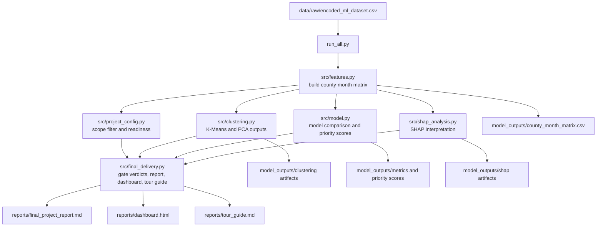

# MecDonate

MecDonate is a Big Data Analytics final project for county-level donation-ratio analysis and prediction using Taiwan e-invoice data. The main delivery pipeline reads the encoded raw dataset, builds a county-month feature matrix, clusters scoped counties, compares regression models, explains the best tree model with SHAP, and writes formal reports plus a static dashboard.

## Project Architecture



## Repository Layout

```text
data/
  raw/                         source CSV inputs and label tables
  county_zscore_split/         standalone county-level scaling outputs
model_outputs/                 machine-readable artifacts from training and evaluation
reports/                       human-facing report, dashboard, and guide outputs
src/                           core modules used by run_all.py
agent_doc/                     governance, gate notes, review policy, and historical records
source_materials/              original proposal and reference materials
run_all.py                     main end-to-end project pipeline
split_scale_by_county.py       standalone county-based scaling preprocessor
train_donation_ratio_county_scaled_xgboost.py
train_donation_ratio_county_scaled_year_cv.py
```

## Main Pipeline

`run_all.py` is the canonical project entrypoint.

1. Read `data/raw/encoded_ml_dataset.csv`.
2. Build the scoped county-month feature matrix with `src/features.py`.
3. Filter to the formal county scope and compute scope readiness with `src/project_config.py`.
4. Run clustering workflows with `src/clustering.py`.
5. Compare regression models and generate priority scores with `src/model.py`.
6. Compute SHAP importance for the best tree model with `src/shap_analysis.py`.
7. Generate gate verdicts, final report, dashboard, and tour guide with `src/final_delivery.py`.

## Core Inputs and Outputs

- Main raw input: `data/raw/encoded_ml_dataset.csv`
- Main machine-readable output root: `model_outputs/`
- Main human-facing output root: `reports/`

Typical outputs include:

- `model_outputs/county_month_matrix.csv`
- clustering figures and assignment tables
- model comparison metrics and priority scores
- SHAP importance tables and plots
- `reports/final_project_report.md`
- `reports/dashboard.html`
- `reports/tour_guide.md`

## Additional Workflows

These scripts are intentionally separate from `run_all.py`:

- `split_scale_by_county.py`
  Builds county-level train/test splits and county-specific `StandardScaler` outputs under `data/county_zscore_split/`.
- `train_donation_ratio_county_scaled_xgboost.py`
  Trains an XGBoost regressor on the county-scaled train/test CSVs with `donation_ratio` as the target.
- `train_donation_ratio_county_scaled_year_cv.py`
  Runs year-based rolling validation for the county-scaled `donation_ratio` workflow.

These scripts support focused experiments and validation, but they are not prerequisites for the main `run_all.py` delivery pipeline.

## How To Run

Run the main project pipeline from the repository root:

```bash
python run_all.py
```

Run the standalone county-scaling workflow:

```bash
python split_scale_by_county.py
```

Run the county-scaled `donation_ratio` model:

```bash
python train_donation_ratio_county_scaled_xgboost.py
```

Run rolling year validation for the county-scaled `donation_ratio` model:

```bash
python train_donation_ratio_county_scaled_year_cv.py
```

## src Module Guide

Detailed function-level notes for the core pipeline modules are documented in [src/README.md](/Users/tuxinhe/Documents/project_code/Data_minning/final_project/PY_Big_Data_Project/src/README.md).
