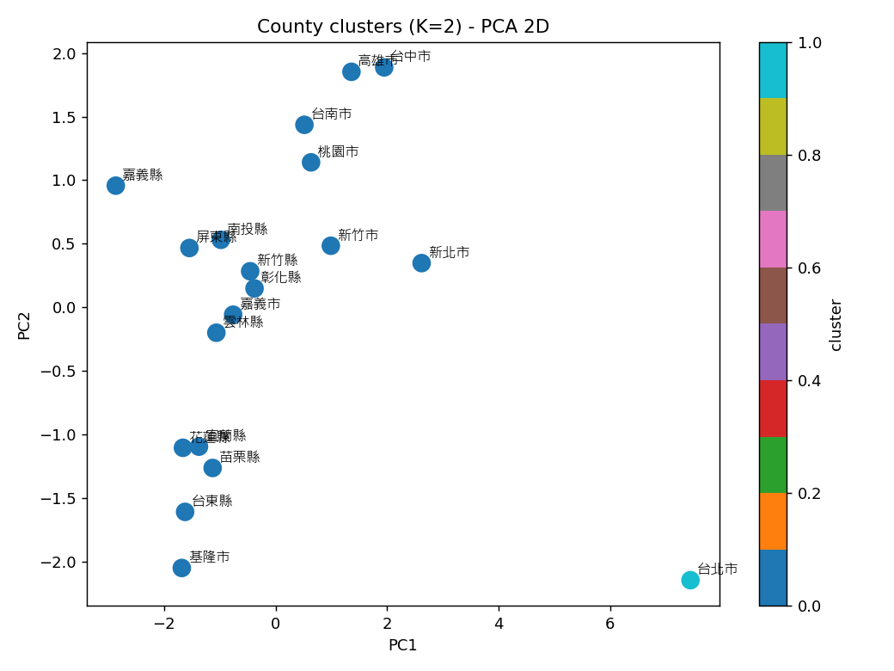
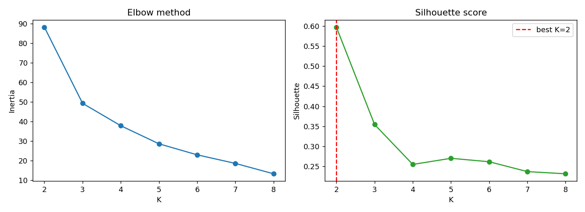
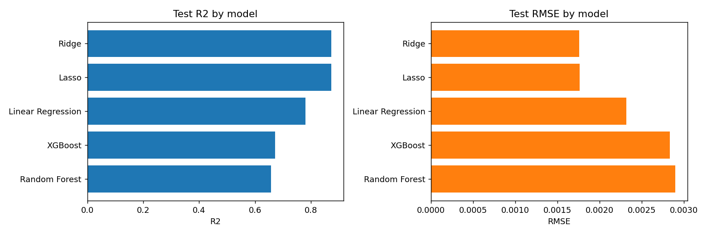
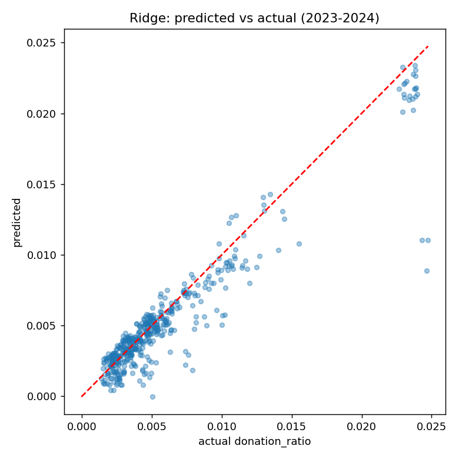
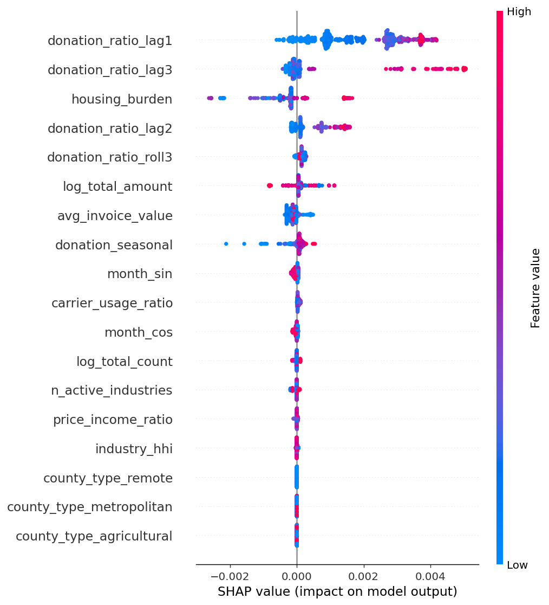

# MecDonate — Results Report

**A Machine Learning Framework for County-Level Invoice Donation Ratio Prediction in Taiwan**
Group 6 · implementation of the proposal in [`group_six.md`](group_six.md)

This report documents the implemented pipeline and its empirical results. All
artefacts are reproducible with `python run_all.py` and are written to
[`outputs/`](outputs/).

---

## 1. Data & feature matrix

The raw file `encoded_ml_dataset.csv` is at the
**county × industry × carrier-type × month** granularity (110,373 rows). The
economic indicators (`housing_burden`, `price_income_ratio`, county invoice
totals) and the target are already constant within a county-month — confirmed
that `donation_ratio = donation_count / total_county_invoice_count`.

We aggregate to a **county × month matrix** (19 counties × 49 months = **931
rows**), [`outputs/county_month_matrix.csv`](outputs/county_month_matrix.csv):

| Group | Features |
|---|---|
| Economic | `housing_burden`, `price_income_ratio`, `log_total_count`, `log_total_amount`, `avg_invoice_value` |
| Behavioural / structural | `carrier_usage_ratio` (share of invoices using an e-carrier), `n_active_industries`, `industry_hhi` (concentration) |
| Seasonality | `donation_seasonal` (STL), `month_sin`, `month_cos` |
| Lag / autocorrelation | `donation_ratio_lag1/2/3`, `donation_ratio_roll3` |
| Categorical | `county_type` (metropolitan / remote / agricultural), one-hot |

**Data caveat (important):** the months are not contiguous — coverage is
2019-01…2020-01 then 2022-01…2024-12 (a 23-month gap). To respect the proposal's
preprocessing plan honestly:
- **STL** is fitted on each county's series after reindexing to a regular monthly
  range and interpolating the gap, then the seasonal component is joined back
  **by date** (the fabricated gap months are discarded).
- **Lag features** are built with a **date join** (`date − L months`), so lags
  that would cross the gap become `NaN` rather than silently using a value 23
  months away. Year-over-year (lag-12) features are therefore unavailable for
  most of the training window and were dropped in favour of lag-1/2/3.
- Z-score standardisation is applied inside the model pipeline (fit on train
  only) for the linear models.

---

## 2. Clustering results

K-Means on the time-averaged county profile (z-scored). K chosen by Elbow +
Silhouette over K = 2…8.

- **Best K = 2** (silhouette = **0.597**; next best K=3 only 0.354).
- **Cluster 1 = {台北市}** alone — a clear outlier with by far the highest
  donation ratio (0.019 vs ≤0.0085 for all others) and the highest housing
  burden (65 vs ≤54).
- **Cluster 0 = the other 18 counties.**




The proposal anticipated a metropolitan-vs-rural split into 2–3 groups. The data
instead separate **Taipei** as a singleton: its donation behaviour and economic
profile are so extreme that it dominates the first principal component, while the
remaining metropolitan and rural counties are not cleanly separable on the
averaged profile. Files: [`cluster_assignments.csv`](outputs/cluster_assignments.csv),
[`clustering_metrics.json`](outputs/clustering_metrics.json).

---

## 3. Prediction performance

Time-based split — **train 2019–2022 (361 usable rows), test 2023–2024 (456
rows)** — evaluated on RMSE and R². Full table:
[`model_comparison.csv`](outputs/model_comparison.csv).

| Model | Test RMSE | Test R² | Train R² |
|---|---|---|---|
| **Ridge** | **0.00176** | **0.874** | 0.937 |
| Lasso | 0.00176 | 0.873 | 0.929 |
| Linear Regression | 0.00232 | 0.781 | 0.940 |
| XGBoost | 0.00283 | 0.672 | 0.995 |
| Random Forest | 0.00290 | 0.657 | 0.985 |




**Finding (differs from the proposal's expectation).** The proposal hypothesised
that XGBoost / Random Forest would outperform the linear baselines. On this
time-split test set the opposite holds: **Ridge/Lasso generalise best (R² ≈
0.87)**, while the tree models clearly **overfit** (train R² ≈ 0.99 but test R² ≈
0.66). With ~360 training rows, strong target autocorrelation, and a temporal
gap, the regularised linear models are the more robust choice. The high test R²
nonetheless confirms the proposal's core claim: **county-level donation ratios
are predictable with acceptable accuracy.**

---

## 4. SHAP feature importance

Computed with `TreeExplainer` on XGBoost over the test set.
[`shap_importance.csv`](outputs/shap_importance.csv).



Top drivers (mean |SHAP|):

1. `donation_ratio_lag1` — **dominant**
2. `donation_ratio_lag3`
3. `housing_burden`
4. `donation_ratio_lag2`
5. `donation_ratio_roll3`, `log_total_amount`, `avg_invoice_value`, `donation_seasonal`

This **matches the proposal's SHAP expectation**: past donation behaviour (the lag
features) is the strongest predictor of future behaviour, with `housing_burden`
the most influential economic indicator and seasonality / scale features playing
a moderate role.

---

## 5. How to run

```bash
pip install scikit-learn xgboost shap statsmodels matplotlib pandas
python run_all.py          # full pipeline -> outputs/
```

Individual stages (from the project root):
`python src/features.py`, `python src/clustering.py`, `python src/model.py`,
`python src/shap_analysis.py`.

## 6. Code layout

| File | Purpose |
|---|---|
| [`src/features.py`](src/features.py) | County-month matrix, STL, lag features, county type |
| [`src/clustering.py`](src/clustering.py) | K-Means + Elbow/Silhouette + PCA |
| [`src/model.py`](src/model.py) | 5-model regression comparison, time split, metrics |
| [`src/shap_analysis.py`](src/shap_analysis.py) | SHAP importance on XGBoost |
| [`run_all.py`](run_all.py) | End-to-end orchestrator |

## 7. Limitations

- The 23-month coverage gap weakens year-over-year features and forces
  interpolation for STL; results for cross-gap months should be read with care.
- Clustering uses time-averaged profiles, so it captures *which counties* differ,
  not *when*.
- Tree models would likely benefit from more data or stronger regularisation; the
  current finding (linear > tree) is specific to this sample size and split.
