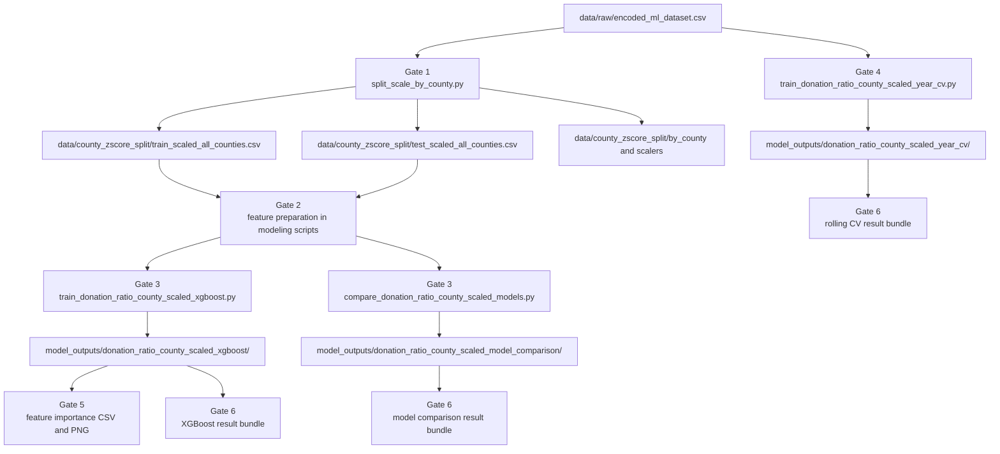

# Pipeline Architecture (Gate 1 to Gate 6)

This diagram reflects the current repository structure and excludes Gate 0 by design.

```mermaid
flowchart TD
    A[data/raw/encoded_ml_dataset.csv] --> B[Gate 1<br/>split_scale_by_county.py]
    B --> C[data/county_zscore_split/train_scaled_all_counties.csv]
    B --> D[data/county_zscore_split/test_scaled_all_counties.csv]
    B --> E[data/county_zscore_split/by_county and scalers]

    C --> F[Gate 2<br/>feature preparation in modeling scripts]
    D --> F

    F --> G[Gate 3<br/>train_donation_ratio_county_scaled_xgboost.py]
    F --> H[Gate 3<br/>compare_donation_ratio_county_scaled_models.py]
    A --> I[Gate 4<br/>train_donation_ratio_county_scaled_year_cv.py]

    G --> J[model_outputs/donation_ratio_county_scaled_xgboost/]
    H --> K[model_outputs/donation_ratio_county_scaled_model_comparison/]
    I --> L[model_outputs/donation_ratio_county_scaled_year_cv/]

    J --> M[Gate 5<br/>feature importance CSV and PNG]
    J --> N[Gate 6<br/>XGBoost result bundle]
    K --> O[Gate 6<br/>model comparison result bundle]
    L --> P[Gate 6<br/>rolling CV result bundle]
```
