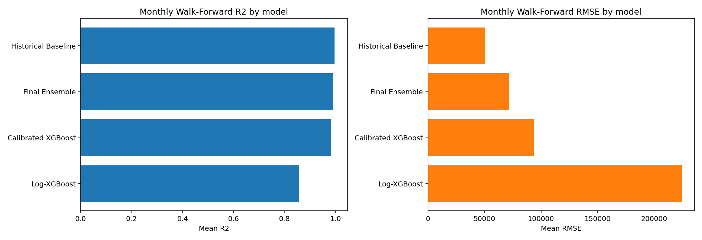

# MecDonate Final Project Report

## Executive Summary

MecDonate's formal pipeline is the Gate 7 county-month `donation_count` ensemble. It uses monthly expanding Walk-Forward Analysis, a `log1p(donation_count)` XGBoost model, train-only county calibration, and a county historical baseline.

- Gate 7 verdict: `PASS`
- Monthly folds: `24`
- Mean monthly ensemble RMSE: `71580.0223`
- Mean monthly ensemble sMAPE: `15.7392%`
- Mean county abs pct diff: `6.5966%`
- Median county abs pct diff: `6.0802%`
- Largest county-count error: `高雄市` with diff `-1129697.7038` and pct diff `-7.6126%`

## Formal Architecture

- Source: `data/raw/encoded_ml_dataset.csv`
- Target: `donation_count`
- Grain: county-month
- Model A: global XGBoost trained on `log1p(donation_count)`
- Model B: county historical baseline from `lag1` and `roll3`
- Model C: train-only county calibration layer
- Final prediction: `0.6 * calibrated_xgb + 0.4 * historical_baseline`
- Validation: monthly expanding Walk-Forward Analysis
- Formal output root: `model_outputs/donation_count_xgboost_ensemble/`

## Model Comparison

| model | rmse | mae | smape | r2 |
| --- | --- | --- | --- | --- |
| Historical Baseline | 50502.7927 | 23113.7442 | 10.3243 | 0.9959 |
| Final Ensemble | 71580.0223 | 32620.1947 | 15.7392 | 0.9904 |
| Calibrated XGBoost | 93718.1415 | 42367.1245 | 21.9098 | 0.9817 |
| Log-XGBoost | 224452.7557 | 85693.8665 | 29.8742 | 0.8568 |

## Monthly Walk-Forward Results

| month | ensemble_rmse | ensemble_mae | ensemble_smape | ensemble_r2 |
| --- | --- | --- | --- | --- |
| 2023-01 | 194626.0458 | 68550.5733 | 22.1010 | 0.9462 |
| 2023-02 | 97021.1751 | 32926.0417 | 22.4562 | 0.9859 |
| 2023-03 | 32168.2203 | 19598.7404 | 17.5425 | 0.9988 |
| 2023-04 | 216433.5294 | 59790.8940 | 14.1564 | 0.9331 |
| 2023-05 | 36436.0182 | 23447.2195 | 16.7178 | 0.9984 |
| 2023-06 | 48165.0938 | 18280.8950 | 4.7856 | 0.9970 |
| 2023-07 | 35767.5858 | 24367.7912 | 23.9843 | 0.9984 |
| 2023-08 | 56607.8606 | 25864.8312 | 8.6381 | 0.9962 |
| 2023-09 | 54990.5502 | 17921.3785 | 8.9767 | 0.9960 |
| 2023-10 | 23094.2212 | 14631.4427 | 10.2428 | 0.9994 |
| 2023-11 | 58354.2824 | 24987.1267 | 11.1393 | 0.9962 |
| 2023-12 | 51157.6654 | 25239.2047 | 14.2992 | 0.9970 |
| 2024-01 | 137305.7753 | 51115.0894 | 16.7326 | 0.9789 |
| 2024-02 | 85584.5047 | 31703.6878 | 11.5087 | 0.9899 |
| 2024-03 | 58679.0220 | 34619.5699 | 20.9399 | 0.9961 |
| 2024-04 | 27573.5938 | 19645.0224 | 12.5822 | 0.9991 |
| 2024-05 | 63784.3268 | 40843.5172 | 18.1332 | 0.9952 |
| 2024-06 | 54988.0795 | 29412.3364 | 8.4726 | 0.9965 |
| 2024-07 | 58604.8429 | 26723.0271 | 10.4881 | 0.9963 |
| 2024-08 | 50711.3295 | 29897.7059 | 22.5565 | 0.9973 |
| 2024-09 | 61478.4523 | 44126.8974 | 25.6180 | 0.9954 |
| 2024-10 | 50993.2118 | 35929.2535 | 23.6176 | 0.9971 |
| 2024-11 | 65401.3817 | 32695.6551 | 14.9229 | 0.9956 |
| 2024-12 | 97993.7666 | 50566.7729 | 17.1291 | 0.9901 |

## County Error Audit

| county_label | county_name | actual_donation_count | predicted_donation_count | count_diff | pct_diff | abs_pct_diff |
| --- | --- | --- | --- | --- | --- | --- |
| 18 | 高雄市 | 14,839,807 | 13710109.2962 | -1129697.7038 | -7.6126 | 7.6126 |
| 2 | 台北市 | 97,085,454 | 97893684.0903 | 808230.0903 | 0.8325 | 0.8325 |
| 14 | 桃園市 | 9,407,614 | 8835607.9578 | -572006.0422 | -6.0802 | 6.0802 |
| 11 | 新北市 | 31,756,823 | 31341897.1727 | -414925.8273 | -1.3066 | 1.3066 |
| 3 | 台南市 | 4,857,047 | 4506440.5392 | -350606.4608 | -7.2185 | 7.2185 |
| 10 | 彰化縣 | 2,132,807 | 1786537.1461 | -346269.8539 | -16.2354 | 16.2354 |
| 1 | 台中市 | 9,753,670 | 9478300.0351 | -275369.9649 | -2.8232 | 2.8232 |
| 12 | 新竹市 | 1,693,257 | 1436944.7084 | -256312.2916 | -15.1372 | 15.1372 |
| 9 | 屏東縣 | 1,321,812 | 1129230.4585 | -192581.5415 | -14.5695 | 14.5695 |
| 7 | 基隆市 | 2,048,990 | 1858033.5685 | -190956.4315 | -9.3195 | 9.3195 |
| 13 | 新竹縣 | 1,863,961 | 1704912.2871 | -159048.7129 | -8.5328 | 8.5328 |
| 5 | 嘉義市 | 1,169,869 | 1052490.9793 | -117378.0207 | -10.0334 | 10.0334 |
| 8 | 宜蘭縣 | 736,259 | 676874.7352 | -59384.2648 | -8.0657 | 8.0657 |
| 17 | 雲林縣 | 1,683,422 | 1722922.9520 | 39500.9520 | 2.3465 | 2.3465 |
| 16 | 苗栗縣 | 1,288,903 | 1314406.2442 | 25503.2442 | 1.9787 | 1.9787 |
| 15 | 花蓮縣 | 444,612 | 419529.0515 | -25082.9485 | -5.6415 | 5.6415 |
| 4 | 台東縣 | 305,964 | 291164.7630 | -14799.2370 | -4.8369 | 4.8369 |
| 0 | 南投縣 | 500,977 | 488042.6291 | -12934.3709 | -2.5818 | 2.5818 |
| 6 | 嘉義縣 | 487,757 | 488652.0803 | 895.0803 | 0.1835 | 0.1835 |

## Top County-Month Errors

| county_label | county_name | month | actual_donation_count | ensemble_prediction | count_diff | pct_diff |
| --- | --- | --- | --- | --- | --- | --- |
| 2 | 台北市 | 2023-04 | 3,730,587 | 4671188.4369 | 940601.4369 | 25.2132 |
| 2 | 台北市 | 2023-01 | 3,727,852 | 4553013.8206 | 825161.8206 | 22.1350 |
| 2 | 台北市 | 2024-01 | 4,147,192 | 3594464.6268 | -552727.3732 | -13.3277 |
| 2 | 台北市 | 2023-02 | 3,635,510 | 4052542.6631 | 417032.6631 | 11.4711 |
| 2 | 台北市 | 2024-02 | 3,694,303 | 4051609.9035 | 357306.9035 | 9.6718 |
| 14 | 桃園市 | 2024-12 | 559,207 | 869856.1570 | 310649.1570 | 55.5517 |
| 2 | 台北市 | 2024-11 | 4,432,607 | 4186415.5728 | -246191.4272 | -5.5541 |
| 2 | 台北市 | 2023-09 | 3,819,302 | 4056657.1831 | 237355.1831 | 6.2146 |
| 2 | 台北市 | 2024-07 | 4,258,496 | 4034827.5928 | -223668.4072 | -5.2523 |
| 2 | 台北市 | 2024-12 | 4,426,203 | 4206901.3995 | -219301.6005 | -4.9546 |
| 2 | 台北市 | 2023-11 | 4,148,939 | 3930988.4958 | -217950.5042 | -5.2532 |
| 11 | 新北市 | 2023-08 | 1,417,554 | 1208011.2418 | -209542.7582 | -14.7820 |

## Feature Importance

XGBoost feature gain:

| feature | importance |
| --- | --- |
| month_num | 0.1191 |
| county_label_2 | 0.1015 |
| month_sin | 0.0994 |
| county_label_11 | 0.0666 |
| time_index | 0.0660 |
| donation_count_lag1 | 0.0647 |
| row_count_per_county_month | 0.0614 |
| donation_count_roll3_max | 0.0468 |
| month_cos | 0.0419 |
| carrier_usage_ratio | 0.0337 |
| n_active_industries | 0.0318 |
| county_label_18 | 0.0317 |

SHAP mean absolute importance:

| feature | mean_abs_shap |
| --- | --- |
| county_label_2 | 0.3449 |
| donation_count_roll3_max | 0.2725 |
| county_label_11 | 0.2203 |
| row_count_per_county_month | 0.1767 |
| county_label_18 | 0.1640 |
| county_label_14 | 0.1408 |
| donation_count_lag1 | 0.1340 |
| county_label_1 | 0.1267 |
| month_num | 0.1208 |
| county_label_4 | 0.1026 |
| donation_count_roll3_min | 0.0871 |
| county_label_6 | 0.0783 |

## Gate Summary

| gate | name | verdict | score |
| --- | --- | --- | --- |
| Gate 0 | Data readiness | PASS | 5 |
| Gate 1 | Preprocessing and split construction | PASS | 5 |
| Gate 2 | Feature engineering | PASS | 5 |
| Gate 3 | Formal model build | PASS | 5 |
| Gate 4 | Monthly walk-forward validation | PASS | 5 |
| Gate 5 | Interpretability and audit | PASS | 5 |
| Gate 6 | Final delivery | PASS | 5 |
| Gate 7 | Formal ensemble acceptance | PASS | 5 |

## Output Inventory

- `model_outputs/donation_count_xgboost_ensemble/monthly_walk_forward/`
- `model_outputs/donation_count_xgboost_ensemble/monthly_walk_forward_summary.csv`
- `model_outputs/donation_count_xgboost_ensemble/model_comparison.csv`
- `model_outputs/donation_count_xgboost_ensemble/model_comparison.png`
- `model_outputs/donation_count_xgboost_ensemble/metrics.json`
- `model_outputs/donation_count_xgboost_ensemble/ensemble_predictions.csv`
- `model_outputs/donation_count_xgboost_ensemble/county_validation_comparison.csv`
- `model_outputs/donation_count_xgboost_ensemble/shap_importance.csv`
- `model_outputs/gate0_verdict.json` through `model_outputs/gate7_verdict.json`
- `reports/final_project_report.md`
- `reports/dashboard.html`
- `reports/formal_model_comparison.png`
